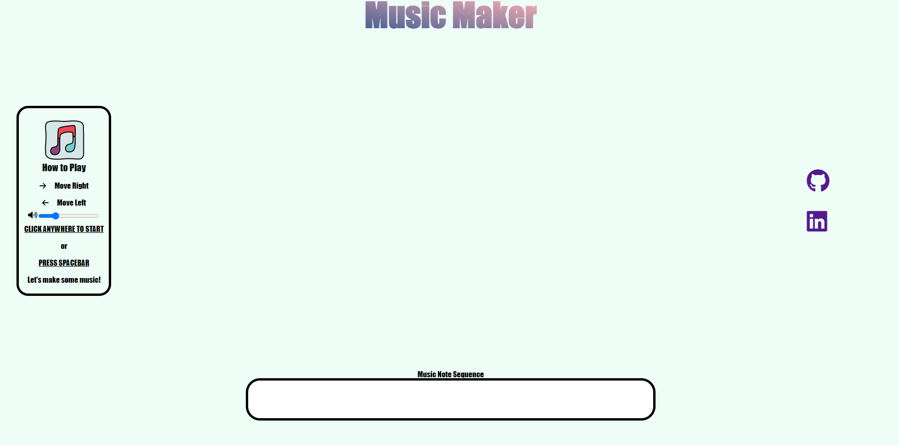
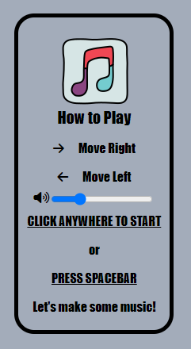
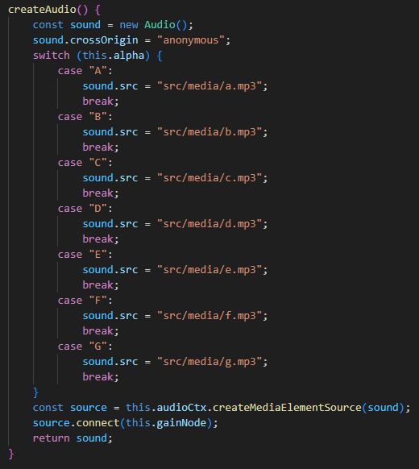
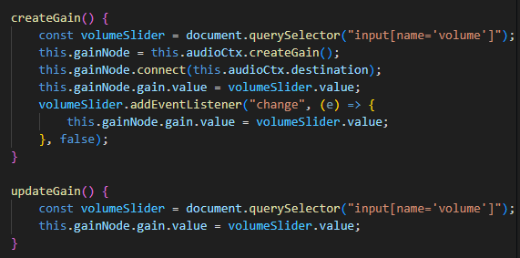
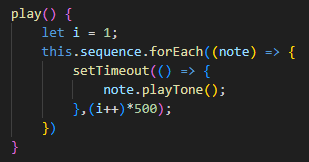
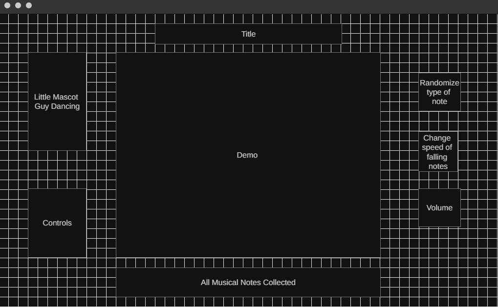

# Interactive Music Maker

## Description
Music Maker is a fun interactive game-like demo where you collect musical notes falling from the sky. As you catch notes, the sequence will show up at the bottom of the screen until they reach the limit - at which point, your self collected music notes will play! 

URL: [Music Maker](https://yuris1234.github.io/Music-Maker/)

## Controls
The controls can be found on the left of the screen:

You should be able to:
- Move a catcher around at the bottom of the screen to catch notes
- Start and reset the game state
- Change the volume of the music

## Feature Implementation

### Audio Files
The implementation of music notes is possible in two different ways: the first and most rudimentary method is to hardcode the frequency of each music note in each octave. 

I implemented the other method, which instead plays the audio file for each note (only in the 4th octave, to keep things simple):

### Volume Control
The (gainNode) represents the volume input from the user, which modifies and connects the original audio file to the ultimate Audio Context:

### Sequence Playback
Playback of all music notes as soon as the user has collected 10:

## Future Development
The original concept for the project can be found below:

Plans include the addition of:
- Toggles for different music notes, octaves, and falling speeds
- A little mascot guy to dance to the music
- A backing track to the music note collection
- A colorful disco ball to appear over the screen while the music is playing

## Technologies, Libraries, APIs
This project was implemented with the following technologies:
- The Canvas API to render the board
- npm and webpack
- Web Audio API
